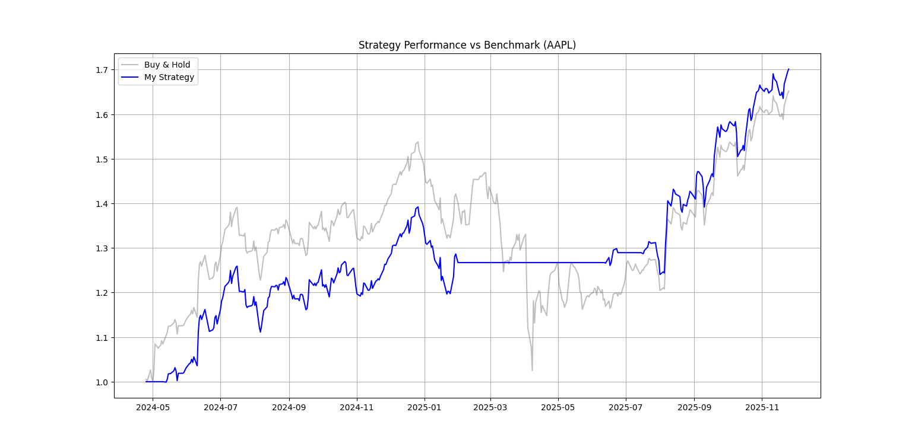

# Vectorized Algorithmic Trading Engine
### Dynamic Moving Average Backtester

A robust, object-oriented backtesting engine capable of simulating technical analysis strategies on historical financial data. It features a vectorized execution model for high-performance testing (utilizing Pandas/NumPy) and includes a parameter optimizer (Grid Search) to identify alpha-generating signal combinations.

## Project Architecture
```text
algo-trading-engine/
|-- backtester.py     # Encapsulates data logic, signal generation, and performance metrics (OOP).
|-- optimizer.py      # Implements Grid Search to solve for optimal Lookback Windows.
|-- main.py           # Entry point for strategy execution and visualization.
|-- requirements.txt  # Python dependencies.
|-- .gitignore        # Git configuration.
|-- README.md         # Project documentation.
```

## Strategy: Golden Cross (Momentum)
The strategy utilizes a "Golden Cross" methodology to capture medium-term momentum. It employs two Simple Moving Averages (SMA):
- Fast Line (SMA_25): Reacts quickly to price changes; represents the short-term trend.
- Slow Line (SMA_55): Reacts slowly; filters out noise and represents the medium-term trend.

### The Math
The Simple Moving Average (SMA) is calculated as the arithmetic mean of the closing prices over the last $N$ days:
$$SMA_n = \frac{1}{n} \sum_{i=0}^{n-1} P_{t-i}$$
### Trading Logic
- The system generates signals based on the crossover of these two indicators:
- BUY SIGNAL (Long): When the Fast Line (25) crosses above the Slow Line (55). This indicates that short-term momentum is outpacing the long-term average.
- SELL SIGNAL (Neutral/Cash): When the Fast Line (25) crosses below the Slow Line (55). This indicates momentum is failing, triggering a shift to a risk-off position.

## Performance Analysis
The engine was backtested on Apple (AAPL) data from 2024-2025.

Key Insight: Notably, during the Q1 2025 market correction, the algorithm successfully identified the trend reversal and shifted to a cash position (neutral). This risk management behavior prevented the ~30% drawdown that the "Buy & Hold" benchmark suffered, allowing the strategy to significantly outperform the underlying asset by year-end.



## How to Run
### 1. Clone the repository:
```
    https://github.com/SamaKool/Algo-Trading-Engine.git
```
### 2. Install dependencies:
```
    Bashpip install -r requirements.txt
```
### 3. Run the strategy:
```
    Bashpython main.py
```
## Future Roadmap
Planned improvements to enhance the engine's capability:
- Short Selling: Implementing logic to profit from downtrends rather than just moving to cash.
- Risk Metrics: Calculating Sharpe Ratio, Sortino Ratio, and Max Drawdown automatically.
- Walk-Forward Optimization: Implementing rolling-window training to validate parameters and prevent overfitting to historical data.